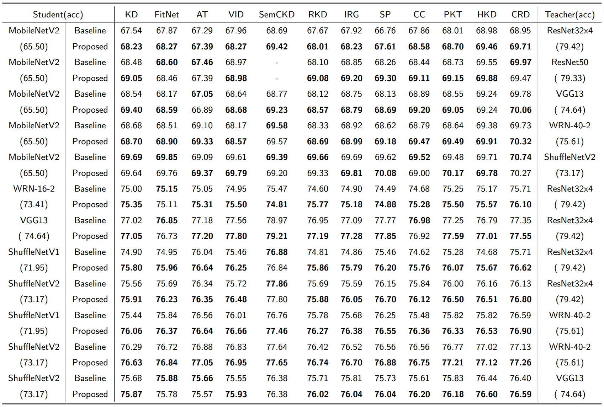

# Generating stronger student models via genetic recombination

This paper contains  the compared approaches, such as classic KD, *Feature-Based Distillation* variants like FitNet, AT, VID,SemCKD and *Relation-Based Distillation* variants like RKD,IRG,SP, CC, PKT,HKD,CRD.This code only shows a portion of the methods used. In the file GR_weight, the optimal weights trained by our method for the "ResNet32x4 & ShuffleNetV1" combination are displayed.

**CIFAR-100 Results**



Top-1 accuracy (%) of student models, derived from 12 modern knowledge distillation methods for transfer across very different teacher and student architectures, both before and after enhancement through the proposed genetic recombination. Those values in bold denote the better results in the corresponding cases. 

To get the pretrained teacher models for CIFAR-100:

```
sh scripts/fetch_pretrained_teachers.sh
```

Running on CIFAR-100:

```bash
# CIFAR-100-baseline
python train_student.py --path-t ./save/models/resnet32x4_vanilla/ckpt_epoch_240.pth --distill semckd --model_s resnet8x4 -r 1 -a 1 -b 400 --trial 0
# CIFAR-100-proposed
python train_formal_shufflenetv1_resnet32x4_exc.py --path-t ./save/models/resnet32x4_vanilla/ckpt_epoch_240.pth --mindex=1 --distill kd --model_s ShuffleV1 --exc_epoch=$exc_epoch -r 1 -a 1 -b 0 --trial $trial
```
